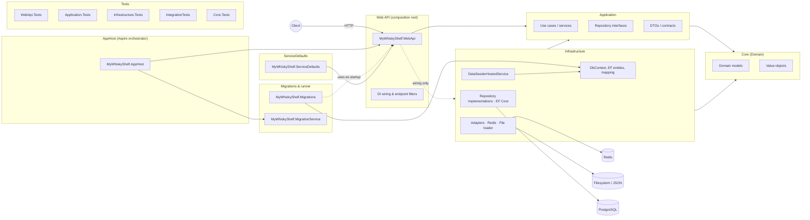

# MyWhiskyShelf
A Whisky Shelf app to allow you to add bottles / drams you've had, and store information about bottles you own.

### Mutation Status

| Branch | Project        | Score                                                                                                                                                                                                                                                                                                                            |
|--------|----------------|----------------------------------------------------------------------------------------------------------------------------------------------------------------------------------------------------------------------------------------------------------------------------------------------------------------------------------|
| Main   | Total          | [](https://dashboard.stryker-mutator.io/reports/github.com/MartinWheelerDotNet/MyWhiskyShelf/main)                                                 |
|        | AppHost        | [](https://dashboard.stryker-mutator.io/reports/github.com/MartinWheelerDotNet/MyWhiskyShelf/main?module=AppHost)               |
|        | Application    | [](https://dashboard.stryker-mutator.io/reports/github.com/MartinWheelerDotNet/MyWhiskyShelf/main?module=Application)       |
|        | Infrastructure | [](https://dashboard.stryker-mutator.io/reports/github.com/MartinWheelerDotNet/MyWhiskyShelf/main?module=Infrastructure) |
|        | WebApi         | [](https://dashboard.stryker-mutator.io/reports/github.com/MartinWheelerDotNet/MyWhiskyShelf/main?module=WebApi)                 |        

### Quality Gate

[](https://sonarcloud.io/summary/new_code?id=MartinWheelerDotNet_MyWhiskyShelf)<br>
[](https://sonarcloud.io/summary/new_code?id=MartinWheelerDotNet_MyWhiskyShelf)<br>
[](https://sonarcloud.io/summary/new_code?id=MartinWheelerDotNet_MyWhiskyShelf)<br>
[](https://sonarcloud.io/summary/new_code?id=MartinWheelerDotNet_MyWhiskyShelf)<br>
[](https://sonarcloud.io/summary/new_code?id=MartinWheelerDotNet_MyWhiskyShelf)<br>
[](https://sonarcloud.io/summary/new_code?id=MartinWheelerDotNet_MyWhiskyShelf)<br>


### Migrations


Create the migrations:

```
$env:ConnectionStrings__myWhiskyShelfDb = 'Host=localhost;Port=;Database=;Username=;Password='
dotnet ef migrations add InitialMigration -p MyWhiskyShelf.Migrations/MyWhiskyShelf.Migrations.csproj -s MyWhiskyShelf.WebApi/MyWhiskyShelf.WebApi.csproj -c MyWhiskyShelf.Infrastructure.Persistence.Contexts.MyWhiskyShelfDbContext -o Migrations
```

### Project Dependency Diagram

